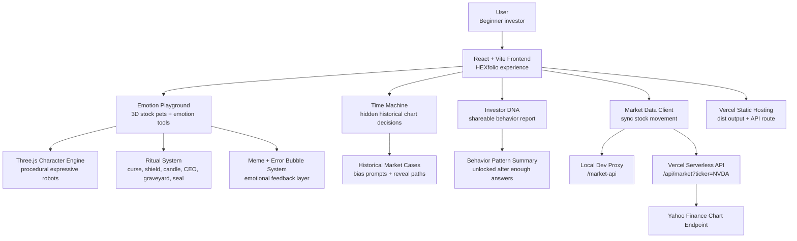
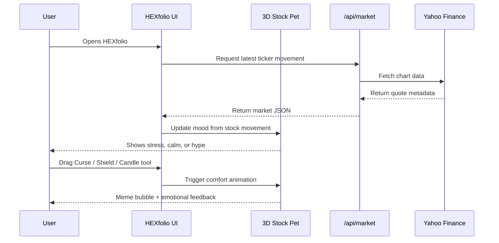

# HEXfolio — Master Your Emotions Before You Master The Market

When the market turns red, your portfolio should not become your personality.

HEXfolio is a behavioral finance web experience that turns stocks into emotional 3D pets. It helps beginner investors notice panic, FOMO, loss aversion, anchoring, and revenge trading before those feelings become trades. Instead of making finance feel colder, HEXfolio makes the messy emotional part visible, playful, and easier to learn from.

Built for **Hackonomics 2027**, a hackathon about connecting computer science, economics, and financial literacy.

## The Problem

Most finance tools assume the user is calm.

Real beginners usually are not.

A stock drops hard. The screen turns red. Someone online says the market is doomed. Another person says this is the perfect dip. Suddenly, the user is not just reading a chart. They are fighting panic, regret, shame, FOMO, and the urge to do something just to feel in control.

That is where financial literacy often breaks. Not because people never learned what a stock is, but because emotion hijacks the moment when the lesson matters most.

HEXfolio was inspired by that feeling, especially after seeing sharp movements in Korean stocks like SK Hynix and Samsung. When prices swing, new investors can fall into doom-scrolling, revenge trading, or blaming themselves. HEXfolio tries to make that moment less lonely and less negative by turning the emotion into something visible, funny, and teachable.

## The Product

HEXfolio is not a stock-picking app. It does not tell users what to buy or sell.

It is a financial literacy playground where market stress becomes an interactive lesson.

### Emotion Playground

Each stock becomes a 3D robot pet with its own mood. If the stock falls, the pet may look stressed or overwhelmed. If it rises, the pet can become excited, but still needs rules.

Users can drag emotion tools onto the pet:

| Tool | What It Means |
| --- | --- |
| Curse | Release panic without pretending the price changed |
| Shield | Separate conviction from risk blindness |
| Candle | Flip the emotional candle, not the real market |
| CEO | Summon silly corporate reassurance and question narratives |
| Graveyard | Put a position away temporarily to stop obsessive checking |
| Seal | Start a cooldown before revenge-clicking |

Sometimes negative red `ERROR` bubbles appear around a losing pet, saying things like `SELL NOW??`, `WHY DID I BUY THIS`, or `PANIC TAB OPEN`. The Curse tool can seal those bubbles away, turning a stressful reaction into a small moment of relief.

### Time Machine

Users are shown only part of a historical stock path. They must choose **Buy**, **Hold**, or **Sell** before the future is revealed.

After the choice, HEXfolio reveals what happened next and explains the behavioral finance lesson behind the moment. The goal is not to predict perfectly. The goal is to notice the bias before it makes the decision.

### Investor DNA

After enough Time Machine answers, users unlock a shareable-style investor report. It summarizes patterns like FOMO, panic selling, patience, and self-awareness in a format that feels more like a social media personality report than a finance worksheet.

## Architecture



## How It Works



## Tech Stack

| Layer | Built With |
| --- | --- |
| Frontend | React, Vite, JavaScript |
| 3D Characters | Three.js |
| UI + Animation | CSS, custom interaction states |
| Icons | Lucide React |
| Market Data | Yahoo Finance chart endpoint |
| API Proxy | Vercel Serverless Function |
| Deployment | Vercel |

## Project Structure

```text
HEXfolio/
├── api/
│   └── market.js          # Vercel serverless function for stock quotes
├── public/
│   ├── hexfolio-logo.png  # site logo + favicon
│   └── rituals/           # emotion tool PNG assets
├── src/
│   ├── main.jsx           # app logic, Three.js robots, modes, market sync
│   └── styles.css         # visual system, layout, animations
├── index.html
├── vite.config.js         # local dev proxy for market data
├── vercel.json            # SPA rewrite for deployed routes
└── package.json
```

## Run Locally

```bash
npm install
npm run dev
```

Open the local URL Vite prints, usually:

```text
http://localhost:5173
```

In this workspace, the app has also been tested on:

```text
http://localhost:5190
```

## Build

```bash
npm run build
```

## Live Demo

HEXfolio is live here:

```text
https://hexfolio.vercel.app/
```

The deployed site includes the React experience and a Vercel serverless market-data endpoint for live quote sync.

## What I Learned

Financial literacy is not only about knowing terms like diversification, valuation, or FOMO. It is also about recognizing the exact moment when emotion tries to drive the decision.

Building HEXfolio taught me that education can be more memorable when it has a body, a face, and a reaction. A paragraph saying "avoid panic selling" is easy to ignore. A tiny robot drowning in red error bubbles is harder to forget.

## What's Next

- Add more historical Time Machine cases
- Make Investor DNA more personalized and shareable
- Add richer portfolio import options
- Improve mobile layout
- Expand the emotion tool system with more playful coping mechanics
- Add a real user progress layer for financial literacy growth

## Disclaimer

HEXfolio is for education and financial literacy. It does not provide investment advice, price predictions, or buy/sell recommendations.
